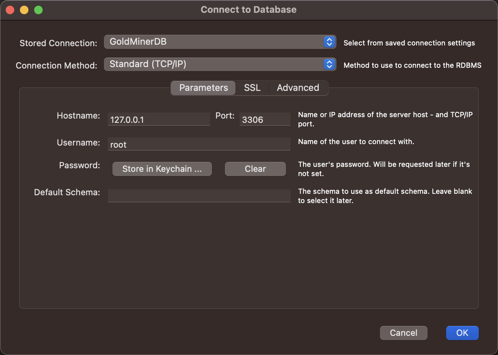
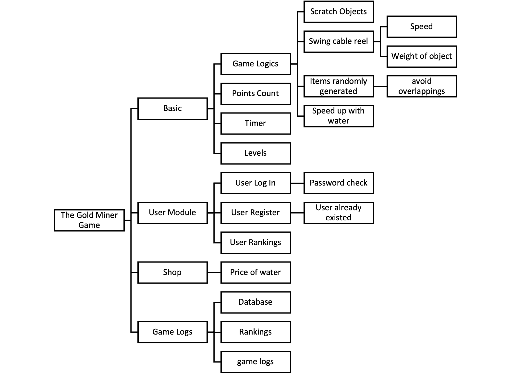
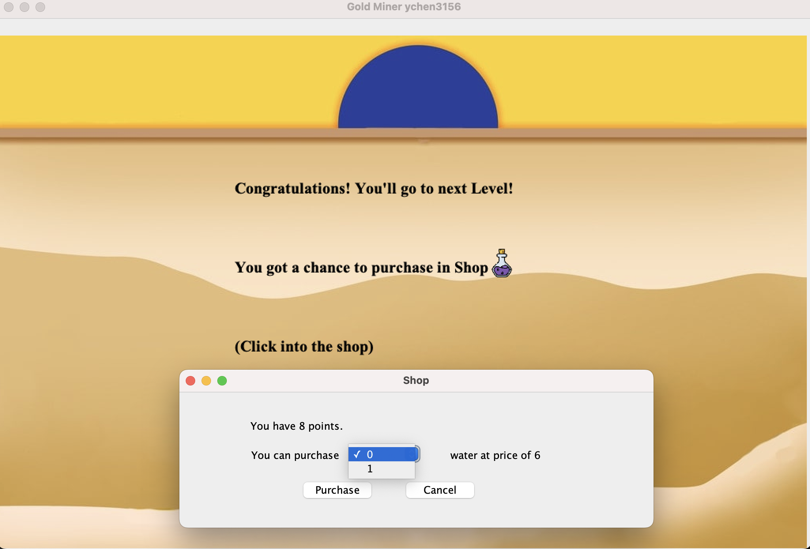
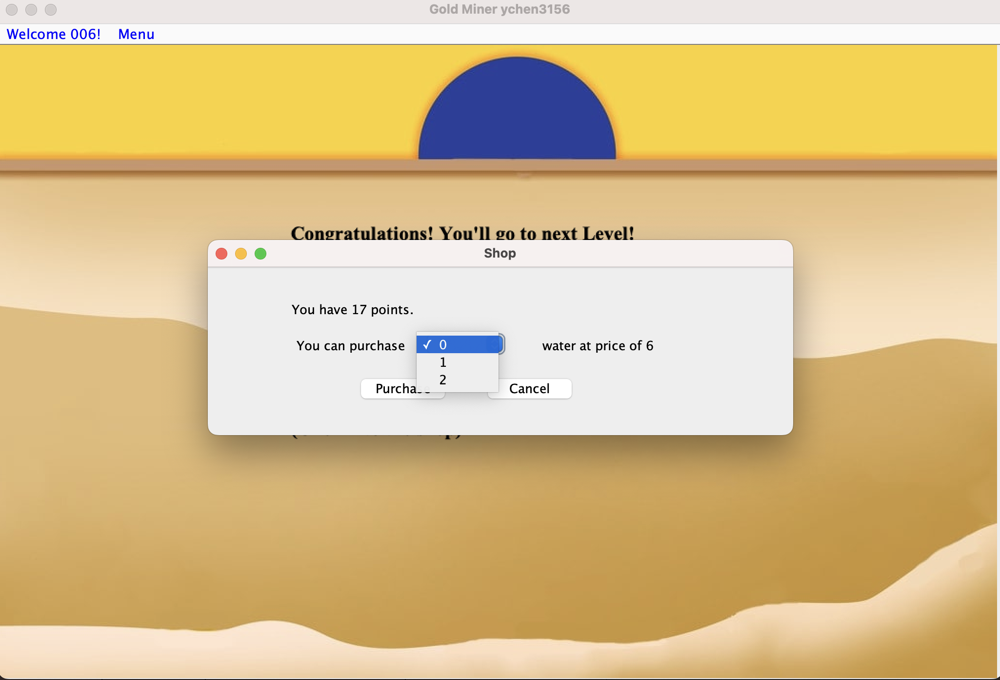
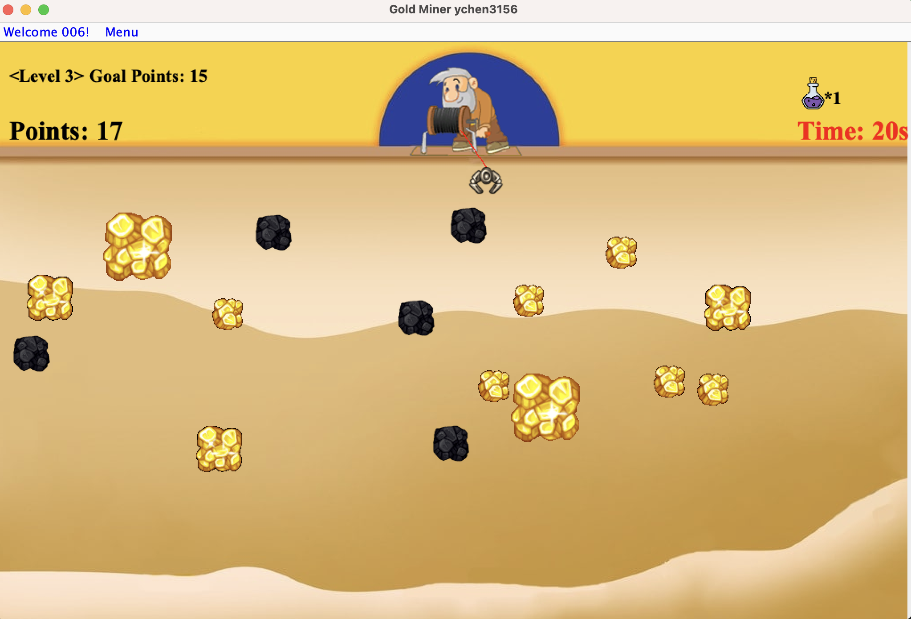
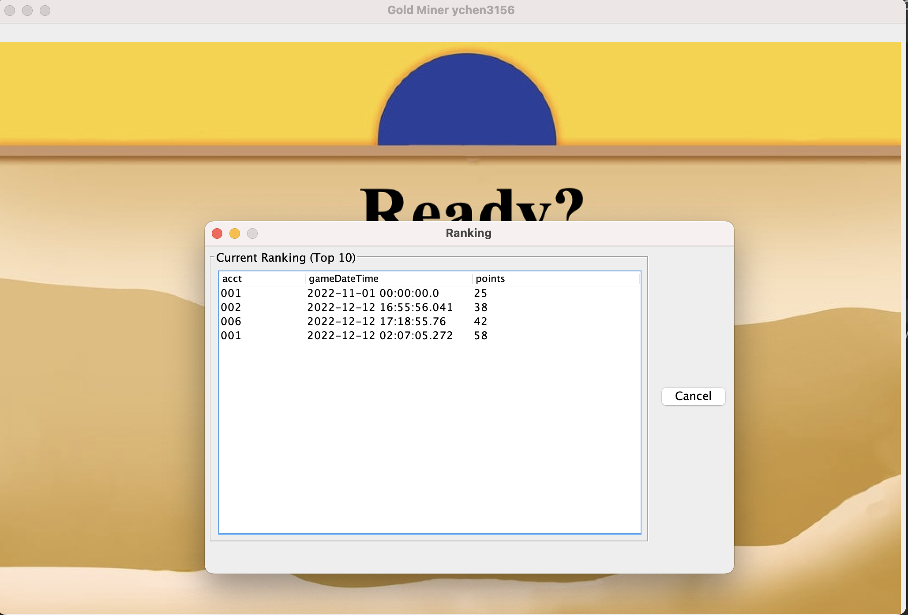
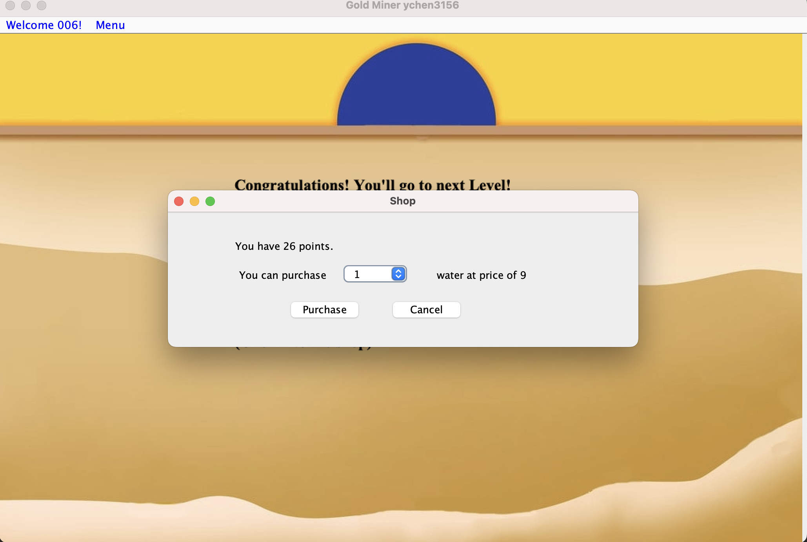

# The Gold Miner Game

## Introduction

The Gold Miner is a classic point-based game developed in Java. The game features a mining cable reel that swings back and forth, allowing you to collect gold and earn points. The game also includes user authentication and keeps track of high scores in a MySQL database.

## Game Logics

- The tool of choice is a mining cable reel that swings back and forth.
- Collect gold quickly enough to reach the gold points to the next level.
- The bigger the gold, the more points you'll get.
- Avoid grabbing rocks as they are worthless and slow you down.

## Database Installation

1. Navigate to the `.../TheGoldMiner/src/sql` directory where you'll find `goldMinerDb.sql`.
2. Use the following credentials for the database:
    - Username: `root`
    - Password: `root1234`




3. Run the command: 
    ```bash
    mysql -u root -p root1234 database_name < filename.sql
    ```
## Environment

- Swing GUI
- Java 19.0 (openjdk 19.0)
- MySQL: mysql-connector-j-8.0.31.jar
- Eclipse: org.eclipse.jdt.launching.JRE_CONTAINER

## Advanced Concepts

- Collections and Graphics (Double Buffering)
- Swing
- Database/JDBC
- Abstract and Generics Class

## User Log In

You'll be prompted to log in at the beginning of the game. You can use the following accounts:
### User Login

- User001
  - Username: `001`
  - Password: `001`
  
- User002
  - Username: `002`
  - Password: `002`

Or you can register your own account. Game records will be stored under your account.

## Objects to Mine

- Giant gold: 8 points
- Regular gold: 4 points
- Mini gold: 2 points
- Rock: 1 point

## Water

You start the game with 3 bottles of water. Water can be used to accelerate the hauling process. Additional water can be purchased between levels.
### Shop Interface

### Price is generated randomly

### Number of Items changed after shopping


## How to Win

You need to pass 5 levels in 20 seconds to win. High scores are stored in the database and displayed in the ranking.

## Game Log Stored
Your records would be stored. The ranking includes yours and other players.

### Ranking compared with other users


## Menu Bar

The menu bar displays your username and provides options for "Log In", "Restart", "Exit", and "Ranking".
### Game Menu

## License

This project is open-source and available under the MIT License.
